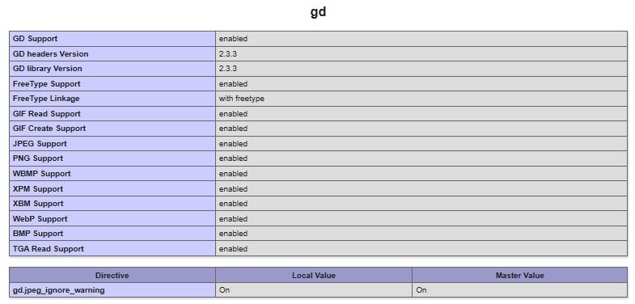

# 🧭 Сайт-визитка на PHP без шаблонизатора

## 📌 Описание

Проект реализует архитектуру MVC на чистом PHP, с контроллером и шаблонами. Несколько статических страниц:  
- 🟦 О нас (`?page=about`)  
- 🟩 Контакты (`?page=contact`)  

## 🧱 Структура проекта

```
mycardsite/
├── README.md                    # Документация проекта
├── app                          # Логика MVC приложения
│   ├── Controllers/             # Контроллеры — управляют отображением страниц
│   │   └── PageController.php   # Обрабатывает роутинг (?page=...) и загружает шаблоны
│   ├── Models/                  # Модели 
│   └── Views/                   # Шаблоны интерфейса
│       ├── about.php            # Статическая страница "О нас"
│       ├── contact.php          # Статическая страница "Контакты"
│       └── layout.php           # Общий макет страницы (навигация, обёртка)
├── public/                      # Публичная часть — доступна из браузера
│   ├── index.php                # Входная точка приложения 
│   └── phpinfo.php              # Проверка подключения модуля php-gd
└── screenshots/                 # Скриншоты проекта
    └── phpinfo.png              # Скриншот успешной активации php-gd
```

## ✅ Проверка подключения php-gd

Модуль `php-gd` установлен и активен:



## 🚀 Запуск проекта

```bash
php -S localhost:8000 -t public
